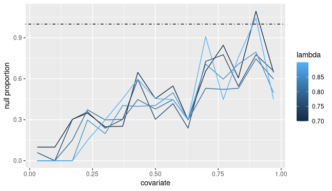

# Prog-Plot

## Introduction

Prog-Plot (progressive proportions plot) is a visual tool to help identify the functional relationship between the covariate and the null proportion in RNA-Seq experimments where a multiple tests correction is performed including a covariate. PP-Plot was made to identify this relationship in the context of the correction proposed by Boca and Leek, that's why it presents curves based on different choices of lambda in a progressive manner.

## Implementation

1. Download the *progplot.R* file to your system
2. Install and load `gtools` and `ggplot`, the latter is optional if you want to do your own plot
3. In your R code, run the following command (replacing `path_to_file` with the actual path in your system where the .R file is located)

```R
ppplot <- dget('/path_to_file/progplot.R')
```
## Use

```R
progplot(
  pval,
  cov,
  lambda=seq(0.85,0.9,0.05),
  cuts=round(log2(length(pval))+1),
  plot=True
)
```

#### Arguments

* **pval**:      numeric vector containing the p-values corresponding to the tests for differential expression
* **cov**:       numeric vector containing the value of the covariate for each test (must be same lenght as pval)
* **lambda**:    numeric vector, tresholds used to define the response of the model, must be in \[0,1)
* **cuts**:      if integer, the number of groups in which the covariate will be divided; if numeric vector of lenght >1, the values of the covariate that define the bins to estimate the null proportion
* **plot**:      logical, if TRUE, a plot will be displayed; if FALSE, the values used to create the plot will be returned and no plot will be displayed

#### Example

```R
library(gtools)
library(ggplot2)
ppplot=dget('progplot.R')

set.seed(50)
X=seq(0,1, length=1000)
n.pr=exp(X*2)/exp(2)
n.I=rbinom(1000,prob=n.pr,size=1) > 0
p.val=rep(NA,1000) 
p.val[n.I]=runif(sum(n.I))
p.val[!n.I]=rbeta(sum(!n.I),1,3)

progplot(p.val,X, lambda = seq(0.7,0.9,0.05), cuts = 15)
```


